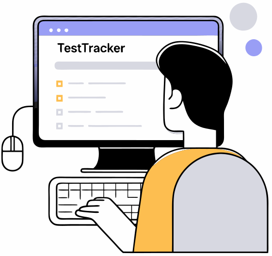

# 테스트 구성

## API Test

API test는 [Postman](https://www.postman.com/)의 script 해석 방식과 호환성을 유지합니다. 따라서 Postman에서 작성된 test code(collection, environment)를 TestTracker에서 어떠한 변경 없이 그대로 적용 후 사용할 수 있습니다. 단, TestTracker에서 collection이나 environment에 대한 직접적인 생성 또는 내용 수정을 지원하지는 않고, Postman에서 작성 후 script file export 후 해당 파일을 TestTracker에 업로드하는 방식으로 적용 가능합니다. (collection의 경우 URL fetch를 통한 적용 가능)

#### collection 적용 (파일 업로드)

1. Postman에서 collection 작성 후 export ([참조](https://learning.postman.com/docs/getting-started/importing-and-exporting/exporting-data/#export-collections))
2.  TestTracker > Workspace > API Test > Test Script Selection :: Collection Choose File 클릭\

    

    <figure><figcaption></figcaption></figure>

    

3. 위 1. 에서 저장한 collection file 선택 후 열기 버튼 클릭&#x20;
4. Upload 버튼 클릭

#### collection 적용 (URL)

#### environment 적용 (파일 업로드)

#### 테스트 데이터  업로드

## UIUX Test

서비스 준비 중입니다.

## Performance Test

서비스 준비 중입니다.

