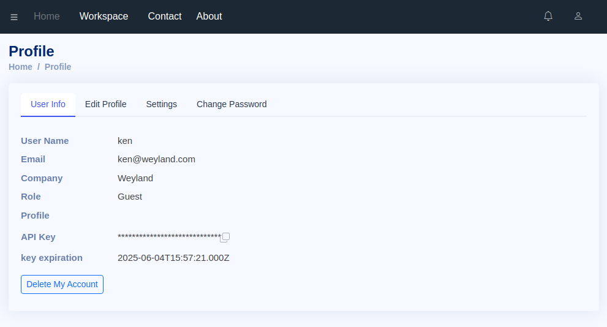

# 멤버 구성 편집

멤버 구성에 대한 설정을 위해 "Workspace > Resource > Setup" 경로의 icon 을 클릭하세요. 아래와 같이 브라우저 화면 우측의 side panel 이 나타나고 "Member Configuration"의 "User Role" 과 "Mailing List" 버튼을 통해 각각의 기능을 실행할 수 있습니다.

<figure><figcaption>
멤버 구성 편집 기능 실행
</figcaption></figure>


멤버 초대(Invite new members) 기능은 현재 버전에서 지원하지 않습니다. 신규 멤버 추가가 필요한 경우 TT-Admin에게 문의 바랍니다.


## User Role 설정

테스트를 위한 자원들은 다수의 팀원들과 공유됩니다. 이 경우 공유 자원에 대한 접근을 제한하거나 접근 권한을 일정한 룰 또는 기준에 의해 차등 부여하는 방법이 요구될 수 있습니다.\
TestTracker에서는 이러한 요구사항을 반영하기 위해 멤버들을 역할(Role)에 따라 그룹을 나누고 각 그룹에 대해 제한된 권한을 부여하고 있습니다.

다음은 TestTracker에서 정의하고 있는 user role의 종류와 각각의 권한에 대한 설명입니다. (상위에 기술된 role 은 하위의 권한을 포함)

<table><thead><tr><th width="146" align="center"></th><th></th></tr></thead><tbody><tr><td align="center">Maintainer</td><td>TestTracker system 관리자(Workspace 관련)</td></tr><tr><td align="center">Manager</td><td>테스트 리소스 관리(생성, 삭제), 팀 멤버 관리(role, mailing list)</td></tr><tr><td align="center">Tester</td><td>테스트 실행, 테스트 예약 등록(삭제는 owner만 가능)</td></tr><tr><td align="center">Guest</td><td>Test Report 및 History 조회, 테스트 실행 불가</td></tr></tbody></table>

TestTracker에 계정을 생성하고 서비스 가입 시 기본적으로 설정되는 user role 은 "Guest"입니다. 이후 TT-Admin 은 리더 또는 관리자 역할을 수행하게 될 팀 멤버의 user role 을 "Manager"로 변경하면 이후 Manager role 을 갖는 멤버에 의해 다른 멤버들의 role 이 설정될 수 있습니다.


Manager("Manager" role 을 갖는 user)에 의해 팀 멤버들의 역할이 설정되고 그로 인한 일부 멤버에게 서비스 제한이 발생할 수 있는 사항은 해당 Manager의 권한이자 책임으로 귀결된다는 점을 참고해 주시기 바랍니다.


다음은 "Manager" role 을 갖는 user에 의해 다른 멤버들의 role 을 변경하는 절차를 설명합니다.\
1\) Member Configuration 에서 "User Role" 선택\
2\) User list 에서 Role 변경을 원하는 user 들 선택 (체크박스)\
3\) 하단의 "User Role" 선택 항목(Combo-box)에서 설정하고자 하는 user role 선택\
4\) "Set" 버튼 클릭

<figure><figcaption>
User role 설정 과정
</figcaption></figure>

## Member 삭제

Maintainer 권한을 갖는 user에게 허용됩니다.

## Mailing List 편집

